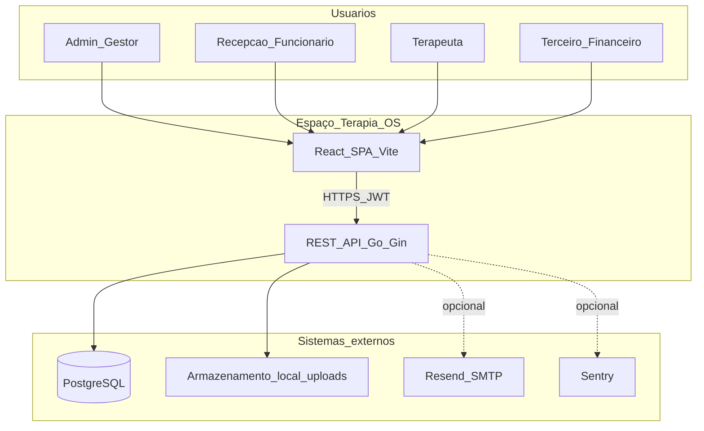

# 00 — Introdução e visão do sistema

## 1. Propósito do sistema

**Espaço Terapia OS** é um sistema de gestão operacional e clínica para **clínica pediátrica multi-filial**. O domínio cobre:

- Cadastro de **unidades** (filiais) e vínculo paciente–unidade
- **Agenda** e **consultas** (agendamento, confirmação, conclusão, fluxo de atendimento/prontuário)
- **Prontuário eletrônico**, **anamneses** e aprovação de atendimentos
- **Profissionais** (terapeutas) com documentação obrigatória e pendências
- **Financeiro**, **contabilidade** (balancete), **RH** (folha CLT/PJ), **contratos** com assinatura/compartilhamento público
- **Planos de saúde**, **ações judiciais**, **notas fiscais** e conciliação
- **Estoque**, **comodato**, **marketing** (materiais/manuais)
- **Biblioteca de documentos** institucionais e **documentos assinados** (chave digital)
- **RBAC** granular (permissões de menu + escopo de dados por role)

## 2. Diagrama de contexto (C4 — nível 1)



## 3. Diagrama de containers (C4 — nível 2)

```mermaid
flowchart LR
  subgraph client [Cliente]
    Browser[Navegador]
    PW[Playwright_E2E]
  end
  subgraph fe [Frontend]
    Vite[Vite_Dev_Server_ou_Nginx_static]
    RQ[TanStack_Query]
    Router[React_Router_v6]
  end
  subgraph be [Backend]
    Gin[Gin_HTTP_8080]
    Svc[Domain_Services]
    Repo[GORM_Repositories]
  end
  subgraph data [Dados]
    DB[(PostgreSQL_16)]
    Uploads[/var/uploads]
  end
  Browser --> Vite
  Vite --> RQ
  RQ -->|/api/v1_proxy| Gin
  Gin --> Svc --> Repo --> DB
  Gin --> Uploads
```

## 4. Personas e papéis (RBAC)

| Role | Descrição típica | Grupos de menu visíveis |
|------|------------------|-------------------------|
| `admin` | Administrador técnico | Todos + Configurações |
| `gestor` | Gestão clínica/operacional | Quase todos exceto alguns itens só-admin |
| `funcionario` | Recepção / apoio | Recepção, Clínico, Profissionais, Documentos |
| `terapeuta` | Profissional de saúde | Meu Painel, Minha Agenda, módulos clínicos |
| `terceiro` | Financeiro/RH externo | Financeiro, RH, Relatórios |

Permissões de menu são strings do tipo `menu.{recurso}.view`, avaliadas em `AuthContext.hasPermission()` e em `ProtectedRoute`.

## 5. Unidade ativa (multi-filial)

O frontend mantém **unidade selecionada** em `UnidadeContext`. Consultas, agenda e listagens filtradas por `unidade_id` (UUID da API). O mapeamento slug local → UUID usa `Unidade.apiId` quando `VITE_API_UNIDADES=true`.

## 6. Documentação relacionada

| Documento | Conteúdo |
|-----------|----------|
| [DEV.md](../DEV.md) | Setup local, E2E, checklist produção |
| [DEPLOY.md](../DEPLOY.md) | Deploy Docker, migrations, permissões uploads |
| [SECURITY.md](../SECURITY.md) | Políticas de segurança |
| [backend/README.md](../../backend/README.md) | API, swagger, seeds |

## 7. Versionamento deste manual

- **Gerado a partir do repositório:** branch de trabalho atual
- **Regenerar PDF:** `npm run docs:manual:pdf` (ver seção final em [MANUAL-TECNICO.md](../MANUAL-TECNICO.md))
- **API OpenAPI:** `cd backend && make swagger`
