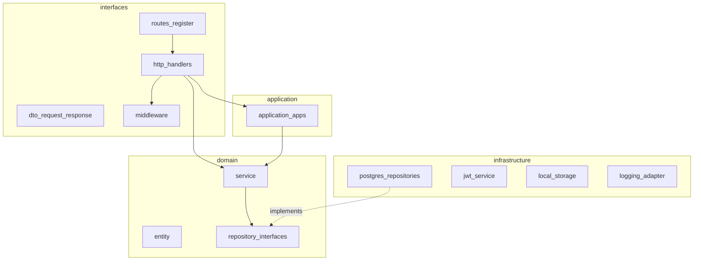

# 02 — Arquitetura em camadas (backend)

## 1. Princípio

O backend segue **arquitetura em camadas** com dependência unidirecional:

```
interfaces → application → domain ← infrastructure
```

- **domain** não importa Gin nem GORM em interfaces públicas (entities + ports).
- **infrastructure** implementa repositórios e adapters (JWT, storage, postgres).
- **interfaces/http** contém apenas adaptadores HTTP finos.

Comparação com NextBridgeAI: herdado o modelo de camadas e migrations; rejeitado DI monolítico — usa `ModuleDeps` modular em [`routes/deps.go`](../../backend/internal/interfaces/http/routes/deps.go).

## 2. Diagrama de pacotes



## 3. Bootstrap HTTP

Arquivo central: [`backend/internal/interfaces/http/routes/routes.go`](../../backend/internal/interfaces/http/routes/routes.go).

Ordem de middleware global:

1. `gin.Recovery()`
2. `middleware.RequestMeta()`
3. `middleware.AccessLog(cfg, logger)` — delega para `logger.GinMiddleware`
4. `middleware.CORS(allowedOrigins)`

Grupo `/api/v1` público:

- `GET/HEAD /health`
- `POST /auth/login`, `/auth/forgot-password`, `/auth/reset-password`, `/auth/token` (bootstrap dev)
- Rotas públicas de contratos (`RegisterContratosPublicRoutes`)

Grupo **protegido** (JWT obrigatório):

1. `RequireConfiguredSecret(JWT_SECRET)`
2. `RequireAuth(jwtService)` — valida Bearer, revogação
3. `ActorContext()` — user_id, roles no contexto
4. `GinUserContext()`
5. `RequirePasswordChanged()` — força troca de senha temporária

Depois: `RegisterProtectedRoutes` (Wave 1–3).

## 4. Módulos registrados (Wave 1–3)

| Ordem | Register | Domínio |
|-------|----------|---------|
| 1 | `register_pacientes` | Pacientes |
| 2 | `register_chave_digital` | Chave + docs assinados |
| 3 | `register_unidades` | Unidades (leitura) |
| 4 | `register_profissionais` | Profissionais + documentos |
| 5 | `register_consultas` | Consultas / agenda |
| 6 | `register_salas` | Salas |
| 7 | `register_notification` | Config notificações |
| 8 | `register_terapias` | Terapias |
| 9 | `register_anamneses` | Anamneses + respostas |
| 10 | `register_prontuario` | Prontuário |
| 11 | `register_financeiro` | Financeiro |
| 12 | `register_relatorios_operacionais` | Relatórios |
| 13 | `register_rh` | RH / folha |
| 14 | `register_estoque` | Estoque |
| 15 | `register_comodatos` | Comodato |
| 16 | `register_planos` | Planos, ações, NF |
| 17 | `register_contratos` | Contratos |
| 18 | `register_marketing` | Marketing |
| 19 | `register_contabilidade` | Contabilidade |
| 20 | `register_audit` | Audit log |
| 21 | `register_users` | Usuários |
| 22 | `register_access_control` | RBAC |
| 23 | `register_documentos` | Biblioteca documentos |

## 5. Padrão de resposta HTTP

**Sucesso:**

```json
{
  "data": { },
  "meta": { "page": 1, "per_page": 20, "total": 100 }
}
```

**Erro:**

```json
{
  "error": {
    "code": "VALIDATION_ERROR",
    "message": "Mensagem amigável",
    "details": [{ "field": "email", "message": "inválido" }]
  }
}
```

Implementação: `internal/interfaces/http` (`ErrorHandler`, helpers de envelope).

## 6. Guards de permissão por recurso

Cada `register_*.go` define `guards` com métodos `read`, `write`, `delete` mapeados para permissões RBAC (ex.: `pacientes.read`, `consultas.write`). Admin bypass onde aplicável via `AccessControlService`.

## 7. Graceful shutdown

[`cmd/api/main.go`](../../backend/cmd/api/main.go): captura `SIGINT`/`SIGTERM`, `http.Server.Shutdown` com timeout 15s, flush Sentry.
