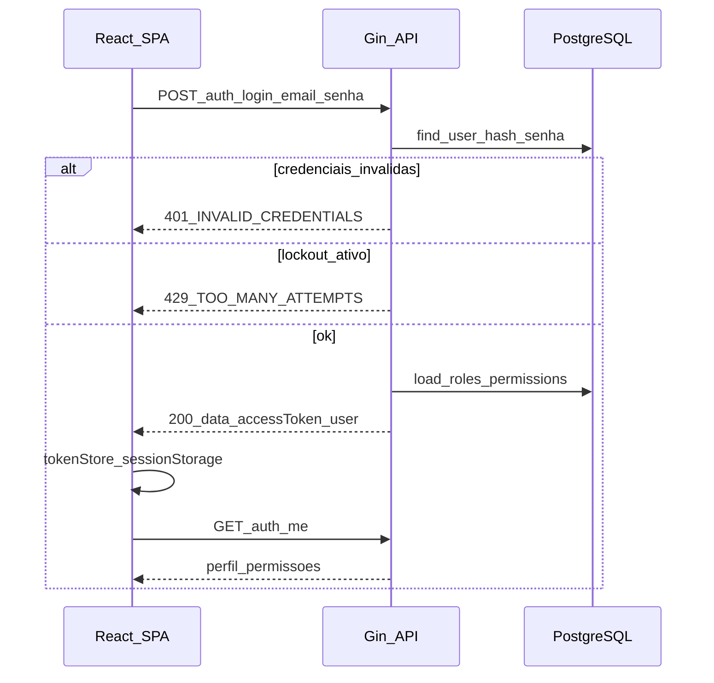
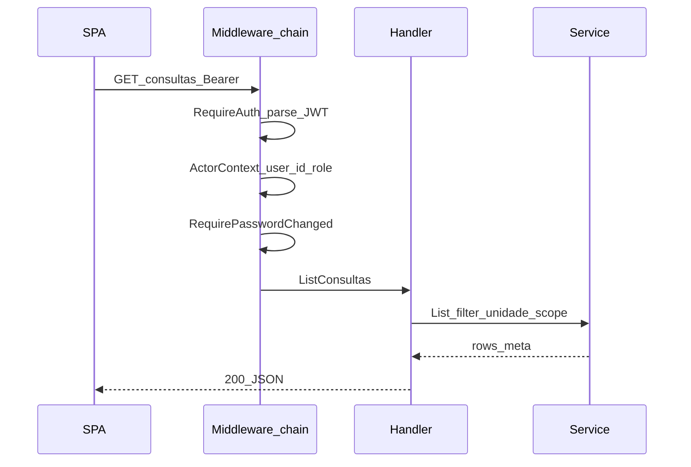

# 07 — Autenticação, autorização e RBAC

## 1. Modelo de autenticação

- **Esquema:** JWT stateless (access token) + tabela `jwt_revocations` para logout/revogação
- **Emissor:** `JWT_ISSUER` (default `espaco-terapia-api`)
- **Transporte:** header `Authorization: Bearer <token>`

## 2. Fluxo de login

**Endpoints:**

| Método | Path | Auth |
|--------|------|------|
| POST | `/auth/login` | Não |
| POST | `/auth/logout` | Sim — revoga JWT |
| GET | `/auth/me` | Sim |
| PATCH | `/auth/me` | Sim |
| PUT | `/auth/me/password` | Sim |
| POST | `/auth/forgot-password` | Não |
| POST | `/auth/reset-password` | Não |
| POST | `/auth/token` | Bootstrap (`X-Bootstrap-Token`) — só dev |

Migrations relevantes: `000003_core_auth`, `000017_auth_security`, `000019_jwt_revocations`, `000020_password_reset`.

## 3. Frontend — AuthContext

Arquivo: [`src/contexts/AuthContext.tsx`](../../src/contexts/AuthContext.tsx).

- Persiste token via [`tokenStore`](../../src/lib/auth/tokenStore.ts)
- `hasPermission(permission: string)` — conjunto de permissões do `/auth/me`
- `ProtectedRoute` redireciona para `/login` se não autenticado
- `mustChangePassword` → `/alterar-senha`

Cliente HTTP: [`src/lib/api/client.ts`](../../src/lib/api/client.ts) — injeta Bearer; `401` dispara logout global.

## 4. RBAC — permissões e roles

Migrations: `000021_rbac_permissions`, `000022_user_roles`, `000023_rbac_data_scopes`.

**Permissões de menu:** strings `menu.*.view` definidas no seed RBAC; sidebar filtra por `hasPermission`.

**Permissões de recurso:** `{recurso}.read|write|delete` — guards nos `register_*.go`.

**Gestão:** página Controles de acesso (`/configuracoes/controles-acesso`):

| Método | Path |
|--------|------|
| GET | `/access-control/permissions` |
| GET | `/access-control/data-scopes` |
| GET | `/access-control/roles/:role` |
| PUT | `/access-control/roles/:role` |

## 5. Escopo de dados (data scope)

`DataScopeRepository` restringe listagens por:

- Unidade do usuário
- Pacientes vinculados ao terapeuta (`terapeuta_responsavel`)
- Regras admin (acesso global)

Aplicado em services de pacientes, consultas, prontuário conforme role.

## 6. Lockout de login

Config: `LOGIN_MAX_ATTEMPTS`, `LOGIN_LOCKOUT_MINUTES`.

Tabela de tentativas (migration `000017`): incremento em falha; bloqueio temporário.

## 7. Diagrama — request autenticado

## 8. Segurança

- Produção: `JWT_SECRET` forte (≥32 bytes aleatórios)
- `BOOTSTRAP_AUTH_ENABLED=false` em produção
- Revogação no logout impede reuso de token roubado (até expiração, se não revogado)
- IDOR: sempre filtrar por `user_id` / `unidade_id` no service, não confiar em IDs do cliente
