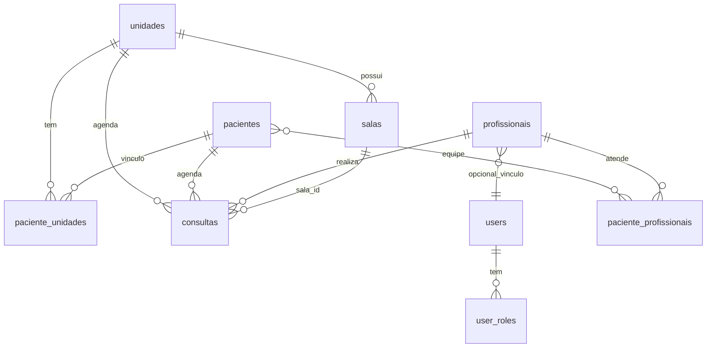
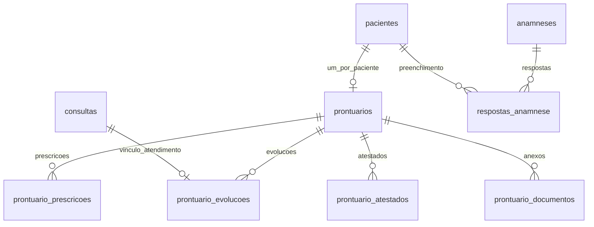
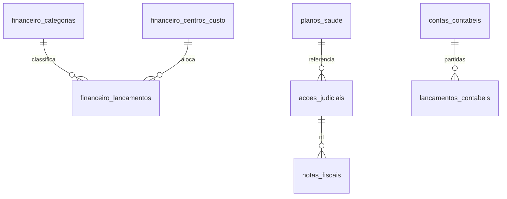
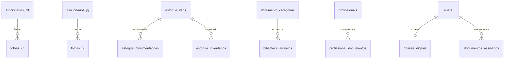

# 08 — Banco de dados PostgreSQL

## 1. Visão geral

- **SGBD:** PostgreSQL 16 (Docker)
- **Extensão:** `pgcrypto` (UUID)
- **Migrations:** 32 versões (`000001`–`000032`)
- **ORM:** GORM com modelos em `infrastructure/database/*_model.go`

## 2. Convenções de schema

| Convenção | Detalhe |
|-----------|---------|
| PK | `UUID DEFAULT gen_random_uuid()` |
| Timestamps | `created_at`, `updated_at` TIMESTAMPTZ |
| Soft delete | `deleted_at` onde aplicável |
| Enums | `CREATE TYPE ... AS ENUM` |
| updated_at | trigger `fn_set_updated_at()` |

## 3. ER — núcleo operacional



## 4. ER — clínico



## 5. ER — financeiro e planos



## 6. ER — RH, estoque, documentos



## 7. Índice de migrations

| Migration | Domínio |
|-----------|---------|
| 000001 | init |
| 000002 | pacientes, unidades |
| 000003 | auth users |
| 000004 | profissionais |
| 000005 | agenda, consultas, salas |
| 000006 | tratamentos |
| 000007 | prontuário |
| 000008 | anamneses |
| 000009 | financeiro |
| 000010 | planos |
| 000011 | RH |
| 000012 | estoque |
| 000013 | contratos |
| 000014 | marketing |
| 000015 | contábil |
| 000016–000020 | auxiliar, audit, jwt, password reset |
| 000021–000023 | RBAC, data scopes |
| 000024 | rename terapias |
| 000025–000027 | paciente_profissionais, salas seed |
| 000026 | consultas.sala_id |
| 000028 | biblioteca documentos |
| 000029 | chaves digitais |
| 000030–000031 | contratos evolution/arquivo |
| 000032 | conciliação NF |

## 8. Operações

```bash
cd backend && make migrate-up    # aplica UP
make migrate-down               # reverte 1 versão
```

**Produção:** sempre backup antes de migration; nunca editar migration já aplicada.

## 9. Consultas críticas (agenda)

Tabela `consultas` — índices em `paciente_id`, `profissional_id`, `data_hora`, `unidade_id` (migration 000005/000026).

Enum `consulta_status`: `agendada`, `confirmada`, `cancelada`, `concluida`.

Enum `status_atendimento`: fluxo prontuário → aprovação.
