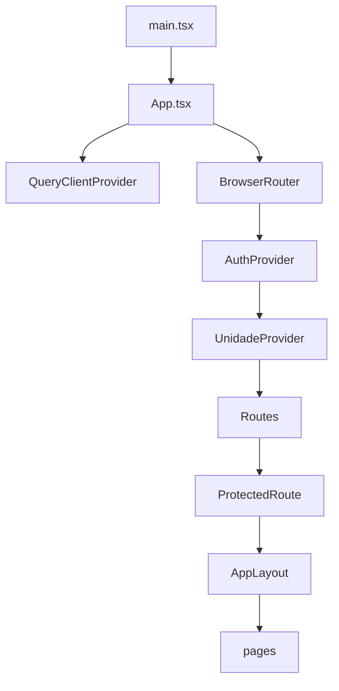

# 09 — Arquitetura frontend (transversal)

## 1. Bootstrap da aplicação



## 2. Layout e navegação

- **Sidebar:** [`AppSidebar.tsx`](../../src/components/layout/AppSidebar.tsx) — `MENU_GROUPS` por fluxo clínico
- **Header:** seletor de unidade, usuário, logout
- **Badges:** [`useMenuBadges`](../../src/components/layout/useMenuBadges.ts) — pendências consultas/profissionais

## 3. Cliente HTTP

[`src/lib/api/client.ts`](../../src/lib/api/client.ts):

- `apiRequest<T>(path, options)` → `{ data, meta }`
- Timeout: `API_TIMEOUT_MS`
- Erros → `ApiClientError` com `code`, `details[]`
- Base URL: `getApiBaseUrl()` — proxy Vite em dev

## 4. React Query — padrões

| Padrão | Exemplo |
|--------|---------|
| Query key | `['consultas', unidadeApiId, filters]` |
| Após mutation | `queryClient.refetchQueries({ queryKey: [...], type: 'active' })` |
| Unidade switch | `UnidadeContext` invalida consultas |
| 401 | sem retry; logout |

## 5. UnidadeContext

[`src/contexts/UnidadeContext.tsx`](../../src/contexts/UnidadeContext.tsx):

- Lista unidades (API ou seed local)
- Persiste seleção (`localStorage`)
- Expõe `unidadeAtiva`, `unidadeApiId` (UUID)
- Resolver: [`src/lib/unidades/apiIds.ts`](../../src/lib/unidades/apiIds.ts)

## 6. Matriz persistência (resumo)

| Módulo | API | Fallback local |
|--------|-----|----------------|
| Pacientes | `VITE_API_PACIENTES` | localStorage legado |
| Consultas/Agenda | `VITE_API_CONSULTAS` | — |
| Profissionais | `VITE_API_PROFISSIONAIS` | parcial |
| Exceções agenda prof. | — | localStorage (`/profissionais/:id/agenda`) |

## 7. Proxy Vite (dev)

`vite.config.ts`: `/api` → `http://localhost:8080` — evita CORS em desenvolvimento.

## 8. Build produção

```bash
npm run build
# dist/ servido por Nginx; VITE_* embutidos no bundle no build-time
```

**Importante:** alterar flags API exige **rebuild** do frontend em produção.

## 9. Rotas não listadas no sidebar

| Rota | Página |
|------|--------|
| `/` | Dashboard |
| `/prontuario/:consultaId` | Prontuário sessão |
| `/configuracoes/*` | Configurações admin |
| `/conta/*` | Perfil/senha |
| `/dashboard-ocupacao` | Ocupação salas |
| `/unidades` | Unidades (menu oculto) |
| `/contratos/compartilhado/:token` | Público |

Ver apêndice [rotas-auxiliares.md](apendices/rotas-auxiliares.md).
