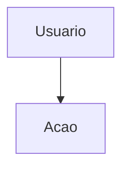
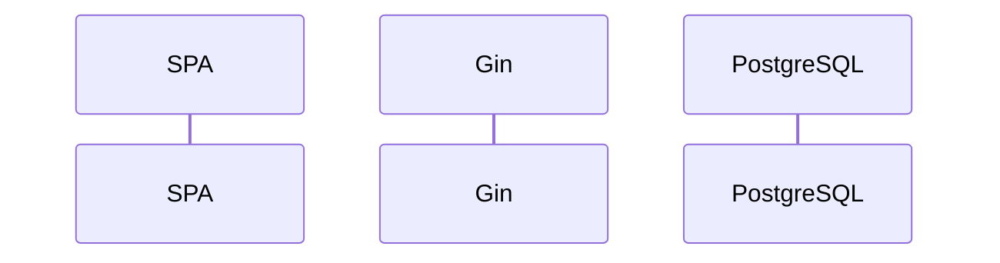

# Módulo: {NOME}

> Template interno — cada capítulo em `modulos/` segue esta estrutura.

## 1. Identificação

| Campo | Valor |
|-------|-------|
| Menu (sidebar) | {grupo} → {título} |
| Rota SPA | `{rota}` |
| Permissão RBAC | `{permission}` |
| Roles (sidebar) | `{roles}` |
| Feature flag | `{VITE_API_*}` |

## 2. Camada de apresentação (UI)

- **Página principal:** `src/pages/{Page}.tsx`
- **Componentes:** (listar)
- **Estado local / React Query:** (keys, staleTime)

## 3. Integração frontend

- **Hook(s):** `src/hooks/use*.ts`
- **Cliente API:** `src/lib/api/*.ts`
- **Modo de dados:** `API` | `localStorage` | `híbrido`

## 4. Backend

- **Registro de rotas:** `backend/internal/interfaces/http/routes/register_*.go`
- **Handler:** `handlers/*_handler.go`
- **Service:** `domain/service/*_service.go`
- **Repository:** `infrastructure/database/postgres_*_repository.go`

## 5. Persistência

- **Migrations:** `0000XX_*.up.sql`
- **Tabelas principais:** (lista)
- **Índices / constraints relevantes**

## 6. Contratos HTTP

| Método | Path | Descrição |
|--------|------|-----------|
| GET | `/api/v1/...` | |

Detalhamento OpenAPI: `GET /api/v1/swagger/index.html` (tag correspondente).

## 7. Fluxos

### 7.1 Fluxograma

### 7.2 Sequência (happy path)

## 8. Testes

- Unitários: (caminhos)
- E2E: (specs)

## 9. Observações de segurança e débitos técnicos

- (IDOR, escopo de unidade, PII, etc.)
