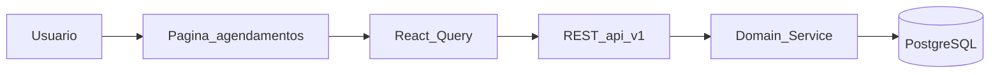
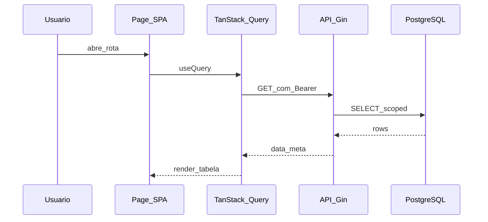

# Agendamentos

## 1. Identificação

| Campo | Valor |
|-------|-------|
| Menu | Recepção → Agendamentos |
| Rota SPA | `/consultas` |
| Permissão RBAC | `menu.consultas.view` |
| Feature flag | `VITE_API_CONSULTAS` |
| Página | `src/pages/Consultas.tsx` |

## 2. UI e componentes

- Entrada principal: `src/pages/Consultas.tsx`
- Layout: `AppLayout` + sidebar filtrada por permissão
- Formulários/modais: ver subpasta `src/components/` do domínio

## 3. Integração frontend

| Artefato | Caminho |
|----------|---------|
| Hook(s) | `useConsultas` |
| API client | `src/lib/api/` (módulo homônimo) |
| Feature flag | `VITE_API_CONSULTAS` |

**Modo de dados:** API quando flag `true`; caso contrário fallback `localStorage` (legado Lovable) onde ainda existir.

## 4. Backend

| Artefato | Caminho |
|----------|---------|
| Rotas | `backend/internal/interfaces/http/routes/register_consultas.go` |
| Handlers | `backend/internal/interfaces/http/handlers/` |
| Services | `backend/internal/domain/service/` |

**Endpoints principais:** CRUD /consultas + POST confirmar|cancelar|concluir|vincular-prontuario|aprovar|rejeitar

## 5. Persistência

**Tabelas:** consultas

Consultar migrations em `backend/migrations/` e ER em [08-banco-dados.md](../08-banco-dados.md).

## 6. Fluxo operacional

## 7. Sequência — leitura lista

## 8. Testes

- Backend: `go test ./internal/domain/service/...`
- Frontend: `*.test.tsx` no domínio, se existir
- E2E: ver `e2e/` para fluxos críticos (ex. agenda em `agenda-sync.spec.ts`)

## 9. Endpoints detalhados (`/api/v1/consultas`)

| Método | Path | Ação |
|--------|------|------|
| GET | `/consultas` | Lista (filtros: `unidade_id`, datas, status) |
| GET | `/consultas/:id` | Detalhe |
| POST | `/consultas` | Criar |
| PUT | `/consultas/:id` | Atualizar |
| DELETE | `/consultas/:id` | Remover |
| POST | `/consultas/:id/confirmar` | Confirmar presença |
| POST | `/consultas/:id/cancelar` | Cancelar |
| POST | `/consultas/:id/concluir` | Concluir atendimento |
| POST | `/consultas/:id/vincular-prontuario` | Associar evolução |
| POST | `/consultas/:id/aprovar-atendimento` | Aprovação gestor |
| POST | `/consultas/:id/rejeitar-atendimento` | Rejeição com motivo |

## 10. Sincronização com Agenda (`/agenda`)

- `useConsultas` usa `unidade.apiId` (UUID) — ver `resolveUnidadeApiIdFromContext`
- Após mutação: `refetchQueries` em chaves `['consultas', unidadeApiId]`
- `Consultas.tsx`: submit **await** + `isSubmitting` — modal só fecha em sucesso

## 11. Débito técnico — fuso horário

O backend interpreta `datetime-local` do HTML como **UTC** (`ParseDateTime`). Em BRT, horários próximos à meia-noite ou validação de expediente podem falhar com 400. Workaround E2E: usar horário 13:00 UTC. Correção definitiva: normalizar para `America/Sao_Paulo` no handler.

## 12. Segurança

- Validar RBAC no guard HTTP antes do handler
- Aplicar data scope por unidade/usuário em services de listagem
- `sala_id` obrigatório (migration 000026) — conflito de sala retorna 409

