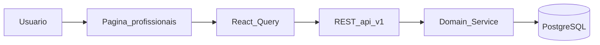
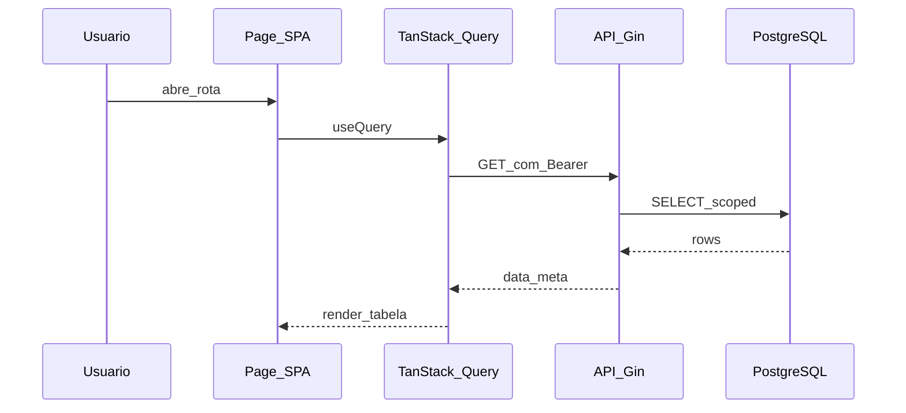

# Profissionais

## 1. Identificação

| Campo | Valor |
|-------|-------|
| Menu | Profissionais → Profissionais |
| Rota SPA | `/profissionais, /profissionais/:id/agenda` |
| Permissão RBAC | `menu.profissionais.view` |
| Feature flag | `VITE_API_PROFISSIONAIS` |
| Página | `src/pages/Profissionais.tsx, AgendaProfissional.tsx` |

## 2. UI e componentes

- Entrada principal: `src/pages/Profissionais.tsx, AgendaProfissional.tsx`
- Layout: `AppLayout` + sidebar filtrada por permissão
- Formulários/modais: ver subpasta `src/components/` do domínio

## 3. Integração frontend

| Artefato | Caminho |
|----------|---------|
| Hook(s) | `useProfissionais` |
| API client | `src/lib/api/` (módulo homônimo) |
| Feature flag | `VITE_API_PROFISSIONAIS` |

**Modo de dados:** API quando flag `true`; caso contrário fallback `localStorage` (legado Lovable) onde ainda existir.

## 4. Backend

| Artefato | Caminho |
|----------|---------|
| Rotas | `backend/internal/interfaces/http/routes/register_profissionais.go` |
| Handlers | `backend/internal/interfaces/http/handlers/` |
| Services | `backend/internal/domain/service/` |

**Endpoints principais:** CRUD /profissionais; documentos upload; /profissionais/documentos/pendencias

## 5. Persistência

**Tabelas:** profissionais, profissional_documentos, conselhos

Consultar migrations em `backend/migrations/` e ER em [08-banco-dados.md](../08-banco-dados.md).

## 6. Fluxo operacional

## 7. Sequência — leitura lista

## 8. Testes

- Backend: `go test ./internal/domain/service/...`
- Frontend: `*.test.tsx` no domínio, se existir
- E2E: ver `e2e/` para fluxos críticos (ex. agenda em `agenda-sync.spec.ts`)

## 9. Distinção crítica: `/profissionais/:id/agenda`

| Rota | Fonte de dados | Propósito |
|------|----------------|-----------|
| `/agenda`, `/consultas`, `/minha-agenda` | API `GET /consultas` | Consultas reais |
| `/profissionais/:id/agenda` | **localStorage** (`AgendaProfissional.tsx`) | Exceções de disponibilidade (férias, almoço) |

Não confundir: alterações na agenda de exceções **não** aparecem na agenda de consultas.

## 10. Documentos do profissional

| Método | Path |
|--------|------|
| GET | `/profissionais/documentos/pendencias` |
| GET | `/profissionais/:id/documentos` |
| POST | `/profissionais/:id/documentos` (multipart) |
| GET | `/profissionais/:id/documentos/:docId/download` |
| DELETE | `/profissionais/:id/documentos/:docId` |

## 11. Segurança

- Validar RBAC no guard HTTP antes do handler
- Upload: validar MIME/tamanho no service; path fora de webroot
- Pendências expostas no badge sidebar `profissionais_pendentes`

