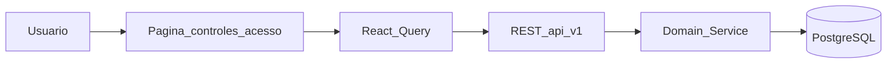
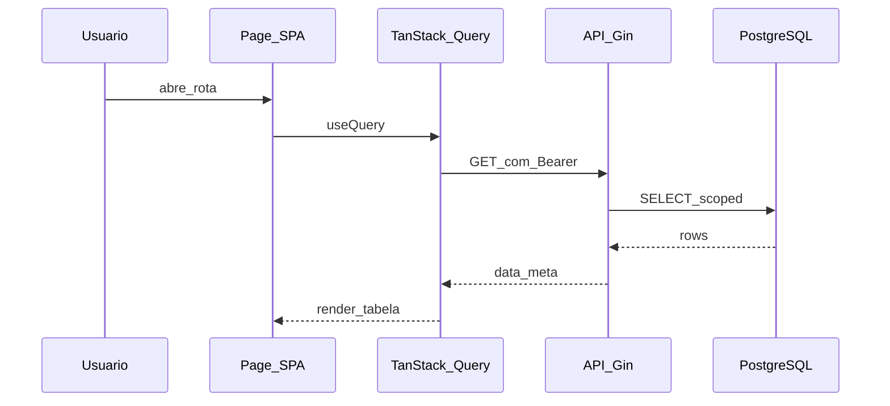

# Controles de Acesso

## 1. Identificação

| Campo | Valor |
|-------|-------|
| Menu | Administração → Controles de acesso |
| Rota SPA | `/configuracoes/controles-acesso` |
| Permissão RBAC | `menu.configuracoes.acessos.view` |
| Feature flag | `—` |
| Página | `src/pages/ControlesAcesso.tsx` |

## 2. UI e componentes

- Entrada principal: `src/pages/ControlesAcesso.tsx`
- Layout: `AppLayout` + sidebar filtrada por permissão
- Formulários/modais: ver subpasta `src/components/` do domínio

## 3. Integração frontend

| Artefato | Caminho |
|----------|---------|
| Hook(s) | `useAccessControl` |
| API client | `src/lib/api/` (módulo homônimo) |
| Feature flag | `—` |

**Modo de dados:** API quando flag `true`; caso contrário fallback `localStorage` (legado Lovable) onde ainda existir.

## 4. Backend

| Artefato | Caminho |
|----------|---------|
| Rotas | `backend/internal/interfaces/http/routes/register_access_control.go` |
| Handlers | `backend/internal/interfaces/http/handlers/` |
| Services | `backend/internal/domain/service/` |

**Endpoints principais:** /access-control/permissions|data-scopes|roles/:role

## 5. Persistência

**Tabelas:** permissions, role_permissions, data_scopes

Consultar migrations em `backend/migrations/` e ER em [08-banco-dados.md](../08-banco-dados.md).

## 6. Fluxo operacional

## 7. Sequência — leitura lista

## 8. Testes

- Backend: `go test ./internal/domain/service/...`
- Frontend: `*.test.tsx` no domínio, se existir
- E2E: ver `e2e/` para fluxos críticos (ex. agenda em `agenda-sync.spec.ts`)

## 9. Segurança

- Validar RBAC no guard HTTP antes do handler
- Aplicar data scope por unidade/usuário em services de listagem
- Não expor IDs de outros tenants/unidades na resposta

